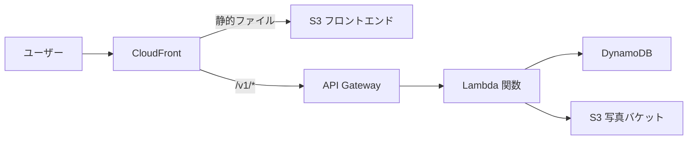

# デプロイ手順書

## 前提条件

- AWS CLI がインストール済みで、`aws sts get-caller-identity` が通ること
- AWS SAM CLI がインストール済みであること
- Node.js 20.x 以上がインストール済みであること
- リージョン: `ap-northeast-1`（東京）
- スタック名: `facereg-app`

## アーキテクチャ概要



| リソース | 用途 |
|---|---|
| CloudFront | CDN・HTTPS終端・ルーティング |
| S3 (Frontend) | React ビルド資産のホスティング |
| S3 (Photos) | 顔写真の一時保管（7日自動削除） |
| API Gateway | REST API エンドポイント |
| Lambda ×4 | ビジネスロジック |
| DynamoDB | 受付データの保管 |

## 継続課金を避ける運用方針

- X-Ray は無効化し、Lambda の CloudWatch Logs は 7 日で削除される設定とする
- 写真データと DynamoDB レコードは 7 日で自動削除し、放置時の保管課金を抑える
- 長期間使わない場合は、スタックを残さず削除してフロント配信とストレージの継続課金を止める

## デプロイ手順

### 1. バックエンドデプロイ（初回・更新共通）

```bash
export ADMIN_AUTH_CREDENTIALS='admin:strong-password'
./scripts/deploy-backend.sh
```

実行内容:
- `sam build` — Lambda 関数のビルド
- `sam deploy` — CloudFormation スタックの作成/更新
- `AdminAuthCredentials` — 管理画面API用の Basic 認証情報を `NoEcho` パラメータとして注入
- 既存 Lambda の未管理ロググループがあれば、CloudFormation 管理へ移行するため先に削除する
- `AdminAuthorizerFunction` が未作成なら、初回のみ Authorizer 参照を外した一時テンプレートを先にデプロイし、その後に通常テンプレートをデプロイ
- 完了後、スタック出力値（API URL、CloudFront URL 等）が表示される

### 2. フロントエンドデプロイ（初回・更新共通）

```bash
./scripts/deploy-frontend.sh
```

実行内容:
- `npm run build` — React アプリのプロダクションビルド
- `aws s3 sync` — ビルド資産を S3 にアップロード
- `aws cloudfront create-invalidation` — CDN キャッシュクリア
- 完了後、アクセス URL が表示される

### 3. 動作確認

スクリプト完了時に表示される CloudFront URL にブラウザでアクセスし、受付画面が表示されることを確認する。

## スタックの削除

プロジェクトが不要になった場合、以下のスクリプトで全リソースを一括削除できる。

```bash
./scripts/destroy-stack.sh
```

内部では以下を実行する。

```bash
# S3 バケットを空にする（中身があると削除できないため）
aws s3 rm s3://$(aws cloudformation describe-stacks \
  --stack-name facereg-app \
  --query "Stacks[0].Outputs[?OutputKey=='FrontendBucketName'].OutputValue" \
  --output text) --recursive

aws s3 rm s3://$(aws cloudformation describe-stacks \
  --stack-name facereg-app \
  --query "Stacks[0].Outputs[?OutputKey=='PhotosBucketName'].OutputValue" \
  --output text) --recursive

# スタック削除
aws cloudformation delete-stack --stack-name facereg-app
```

## 注意事項

- CloudFront の初回作成には **10〜15分** ほどかかる場合がある
- CloudFront と S3 フロントエンド資産は削除するまで残るため、使わない期間は `./scripts/destroy-stack.sh` を実行する
- S3 バケット名にはアカウントIDが含まれるため、`samconfig.toml` は `.gitignore` に追加すること
- カスタムドメインの設定は別タスクとして後日対応予定
