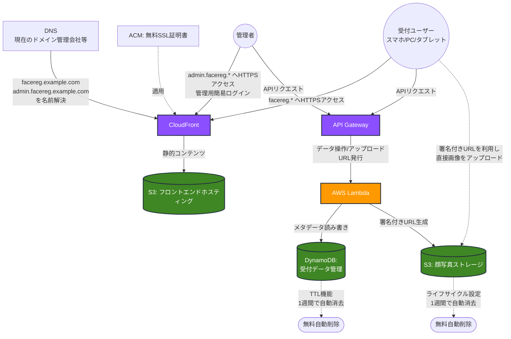

# 顔写真登録アプリ 要件定義書

## 1. システム概要
本システムは、スマホ、PC、タブレット端末から受付での顔写真登録が行えるWebアプリケーションです。小規模かつ低コストでの運用を前提としており、AWSのサーバーレスアーキテクチャを採用して継続的なインフラ費用を最小限に抑えます。

また、ユーザーがアクセスしやすいよう、既存で保有するカスタムドメインを利用して、用途別に2つの入口（サブドメイン）を構成します。
* **受付用（登録画面）**: `facereg.example.com`
* **管理者用（管理画面）**: `admin.facereg.example.com`

## 2. システム要件
### 2.1. 機能要件
* **登録画面（受付用）**
  * 日付、名前、会社名、用件の入力機能。
  * 顔写真の撮影・アップロード機能。
    * スマートフォンの場合はカメラを自動起動。
    * PCの場合はファイルアップロードにも対応。
    * **[コスト対策]** クライアント側（ブラウザ上）で画像を自動的に圧縮・リサイズした上でアップロードし、通信量およびストレージ容量を節約する。
  * 登録完了後、自動的に初期画面（入力画面）に戻る機能（キオスクモード運用に対応）。
  * 本画面にはアクセス制限（ログイン）は設けない。

* **管理画面**
  * 登録された顔写真および入力情報の一覧表示。
  * 検索・絞り込み機能（日付、名前、会社名、用件）。
  * 登録データ（写真エントリー）の個別削除およびチェックボックスを用いた一括削除機能。
  * 登録データの一括ダウンロード機能（写真データ・CSV/JSONを含んだZIPファイル）。
  * バックアップファイルを用いたシステムへの復元（リストア）機能。
  * 簡易ログイン（ID/パスワード）による認証機能。
    * ユーザーID・パスワードの追加・変更機能（初期はシェルスクリプト等による運用を想定）。
    * 継続課金を増やさないため、管理API保護は API Gateway + Lambda Authorizer を優先し、常設課金が増えやすい構成は避ける。

### 2.2. 非機能要件
* **インフラ・ネットワーク**
  * システムへのアクセスはカスタムドメイン（例: `*.example.com`）を利用したHTTPS通信を提供し、SSL/TLS証明書はAWS Certificate Manager（ACM）を利用して無料で自動更新させる。

* **データ保持期間（自動削除）**
  * 登録されたすべての顔写真データ、およびデータベース上のテキストデータは、登録から1週間（7日間）経過時点で自動的に削除されること。
  * S3のライフサイクルルールおよびDynamoDBのTTL機能を利用し、追加のコンピューティングコスト（専用バッチプログラム等）をかけずに実現する。

## 3. アーキテクチャ設計
AWSを利用したサーバーレス構成です。ファイルアップロードの負荷をAPIにかけないため、S3の「署名付きURL（Presigned URL）」機能を用いて端末から直接画像をアップロードする構成とします。

### 3.1. 主要コンポーネント
* **フロントエンド配信**: Amazon CloudFront + Amazon S3
  * HTML/CSS/JavaScriptの静的ファイルを配信し、高速かつ安価に提供します。
* **API（バックエンド）**: Amazon API Gateway + AWS Lambda
  * データベースの操作、およびS3へのアップロード用URLの発行を行います。
  * 常時稼働するサーバーを持たないため、リクエストが発生した時のみ課金されます。
* **データベース**: Amazon DynamoDB
  * 入館記録（テキストデータ）を保存します。
  * 各レコードに有効期限（TTL）を持たせ、7日後に自動・無料で削除させます。
* **ストレージ**: Amazon S3
  * 顔写真ファイルを保存します。
  * ライフサイクルルールを設定し、アップロードから7日後に自動・無料でファイルを削除させます。
* **SSL/TLS証明書**: AWS Certificate Manager (ACM)
  * カスタムドメイン（例: `facereg.example.com`）用の証明書を無料で発行・自動更新します。
* **認証（管理画面）**
  * 継続課金を避けるため、管理画面APIは API Gateway 側の Lambda オーソライザーで Basic 認証を強制します。
  * 認証情報はコードへ直書きせず、SAM デプロイ時の `NoEcho` パラメータから注入します。
